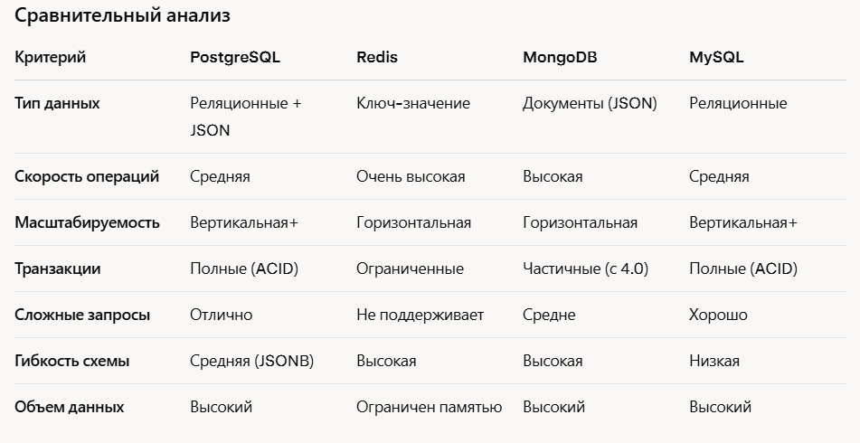

### Расскажи для каких задач больше подходит та или иная база данных: PostgreSQL, Redis, MongoDB, MySQL

1. PostgreSQL
   Тип: Реляционная база данных (SQL)
   Описание:
   PostgreSQL — это мощная open-source реляционная база данных, поддерживающая сложные запросы, транзакции и расширенные возможности вроде JSONB для работы с неструктурированными данными.

Плюсы:
- ACID-совместимость: Полная поддержка транзакций, что гарантирует целостность данных.
- Гибкость: Поддерживает как реляционные, так и нереляционные данные (JSON/JSONB).
- Расширяемость: Можно добавлять свои типы данных, функции и расширения (например, PostGIS для геоданных).
- Сложные запросы: Отлично справляется с JOIN’ами и аналитическими запросами.
- Сообщество и документация: Большое сообщество, надежная поддержка.

Минусы:
- Производительность: Медленнее для простых операций чтения/записи по сравнению с NoSQL решениями вроде Redis.
- Сложность настройки: Требует больше усилий для оптимизации под высокие нагрузки.
- Размер: Может быть избыточной для простых задач.

Подходит для:
- Микросервисы с сложной бизнес-логикой, требующие целостности данных (например, финансы, учетные системы).
- Приложения с реляционными данными и необходимостью аналитики (например, CRM, ERP).
- Сценарии, где важна поддержка JSON для гибридных данных.

2. Redis
   Тип: Ключ-значение (NoSQL), in-memory база данных
   Описание:
   Redis — это сверхбыстрая база данных, работающая в оперативной памяти, с поддержкой структур данных (списки, хэши, множества и т.д.).

Плюсы:
- Скорость: Исключительно высокая производительность благодаря работе в памяти.
- Простота: Идеальна для кэширования и простых операций чтения/записи.
- Поддержка структур: Удобные типы данных (например, очереди, сеты).
- Pub/Sub: Поддержка асинхронного обмена сообщениями между микросервисами.
- Масштабируемость: Легко масштабируется горизонтально с Redis Cluster.

Минусы:
- Ограниченная сложность: Не подходит для сложных запросов или реляционных данных.
- Хранение в памяти: Дорого для больших объемов данных, требует периодической записи на диск (RDB/AOF).
- Нет ACID из коробки: Транзакции ограничены, целостность данных не гарантируется полностью.

Подходит для:
- Кэширование данных для ускорения микросервисов (например, сессии пользователей, результаты запросов).
- Очереди задач (например, с использованием списков Redis).
- Реал-тайм приложения (например, чаты, счетчики).

3. MongoDB
   Тип: Документно-ориентированная база данных (NoSQL)
   Описание:
   MongoDB хранит данные в виде JSON-подобных документов, что делает её гибкой для работы с неструктурированными или полуструктурированными данными.

Плюсы:
- Гибкость схемы: Легко адаптируется к изменениям структуры данных.
- Масштабируемость: Хорошо работает в распределенных системах благодаря шардированию.
- Производительность: Быстрое чтение/запись для нереляционных данных.
- Поддержка агрегаций: Мощный конвейер агрегации для обработки данных.

Минусы:
- Нет строгой целостности: Отсутствие полной ACID-совместимости (хотя с версии 4.0 транзакции улучшены).
- Избыточность данных: Денормализация может привести к дублированию.
- Сложность запросов: Нет поддержки сложных JOIN’ов, как в реляционных базах.

Подходит для:
- Микросервисы с неструктурированными данными (например, каталоги, контент-менеджмент).
- Приложения с быстрым прототипированием, где схема данных часто меняется.
- Высоконагруженные системы с горизонтальным масштабированием (например, соцсети, IoT).

pfp
Ты отлично разбираешься в базах данных как разработчик программного обеспечения для микро-сервисов. Сделай сравнительный анализ, с указанием плюсов и минусов для каждой базы данных и в общем сравнении их. Расскажи для каких задач больше подходит та или иная база данных. Вот перечень баз данных: PostgreSQL, Redis, MongoDB, MySQL

Я проведу сравнительный анализ баз данных PostgreSQL, Redis, MongoDB и MySQL с точки зрения разработчика микросервисов. Оценю их плюсы, минусы и сценарии использования, чтобы вы могли выбрать подходящую базу данных для конкретной задачи.

1. PostgreSQL
   Тип: Реляционная база данных (SQL)
   Описание:
   PostgreSQL — это мощная open-source реляционная база данных, поддерживающая сложные запросы, транзакции и расширенные возможности вроде JSONB для работы с неструктурированными данными.

Плюсы:
ACID-совместимость: Полная поддержка транзакций, что гарантирует целостность данных.
Гибкость: Поддерживает как реляционные, так и нереляционные данные (JSON/JSONB).
Расширяемость: Можно добавлять свои типы данных, функции и расширения (например, PostGIS для геоданных).
Сложные запросы: Отлично справляется с JOIN’ами и аналитическими запросами.
Сообщество и документация: Большое сообщество, надежная поддержка.
Минусы:
Производительность: Медленнее для простых операций чтения/записи по сравнению с NoSQL решениями вроде Redis.
Сложность настройки: Требует больше усилий для оптимизации под высокие нагрузки.
Размер: Может быть избыточной для простых задач.
Подходит для:
Микросервисы с сложной бизнес-логикой, требующие целостности данных (например, финансы, учетные системы).
Приложения с реляционными данными и необходимостью аналитики (например, CRM, ERP).
Сценарии, где важна поддержка JSON для гибридных данных.
2. Redis
   Тип: Ключ-значение (NoSQL), in-memory база данных
   Описание:
   Redis — это сверхбыстрая база данных, работающая в оперативной памяти, с поддержкой структур данных (списки, хэши, множества и т.д.).

Плюсы:
Скорость: Исключительно высокая производительность благодаря работе в памяти.
Простота: Идеальна для кэширования и простых операций чтения/записи.
Поддержка структур: Удобные типы данных (например, очереди, сеты).
Pub/Sub: Поддержка асинхронного обмена сообщениями между микросервисами.
Масштабируемость: Легко масштабируется горизонтально с Redis Cluster.
Минусы:
Ограниченная сложность: Не подходит для сложных запросов или реляционных данных.
Хранение в памяти: Дорого для больших объемов данных, требует периодической записи на диск (RDB/AOF).
Нет ACID из коробки: Транзакции ограничены, целостность данных не гарантируется полностью.
Подходит для:
Кэширование данных для ускорения микросервисов (например, сессии пользователей, результаты запросов).
Очереди задач (например, с использованием списков Redis).
Реал-тайм приложения (например, чаты, счетчики).
3. MongoDB
   Тип: Документно-ориентированная база данных (NoSQL)
   Описание:
   MongoDB хранит данные в виде JSON-подобных документов, что делает её гибкой для работы с неструктурированными или полуструктурированными данными.

Плюсы:
Гибкость схемы: Легко адаптируется к изменениям структуры данных.
Масштабируемость: Хорошо работает в распределенных системах благодаря шардированию.
Производительность: Быстрое чтение/запись для нереляционных данных.
Поддержка агрегаций: Мощный конвейер агрегации для обработки данных.
Минусы:
Нет строгой целостности: Отсутствие полной ACID-совместимости (хотя с версии 4.0 транзакции улучшены).
Избыточность данных: Денормализация может привести к дублированию.
Сложность запросов: Нет поддержки сложных JOIN’ов, как в реляционных базах.
Подходит для:
Микросервисы с неструктурированными данными (например, каталоги, контент-менеджмент).
Приложения с быстрым прототипированием, где схема данных часто меняется.
Высоконагруженные системы с горизонтальным масштабированием (например, соцсети, IoT).

 
4. MySQL
   Тип: Реляционная база данных (SQL)
   Описание:
   MySQL — популярная реляционная база данных, известная своей простотой, надежностью и широкой поддержкой.

Плюсы:
- Простота: Легко устанавливается и настраивается.
- ACID-совместимость: Надежные транзакции для целостности данных.
- Широкая экосистема: Поддерживается большинством фреймворков и инструментов.
- Производительность: Хороша для операций чтения с движком InnoDB.
- Сообщество: Огромная база пользователей и документация.

Минусы:
- Гибкость: Ограничена строгой схемой, сложнее работать с неструктурированными данными.
- Масштабируемость: Вертикальное масштабирование проще, горизонтальное требует усилий (например, через репликацию).
- Скорость: Медленнее NoSQL для простых операций.

Подходит для:
- Микросервисы с четко определенной схемой данных (например, интернет-магазины, системы управления пользователями).
- Приложения, где важна совместимость с legacy-системами.
- Сценарии с умеренной нагрузкой и реляционной логикой.

Общие выводы:
1. PostgreSQL vs MySQL**: PostgreSQL выигрывает в гибкости и сложных запросах, MySQL проще и быстрее для базовых задач с реляционными данными.
2. Redis vs MongoDB: Redis — лучший выбор для кэширования и реал-тайм задач, MongoDB — для работы с большими объемами неструктурированных данных.
3. SQL vs NoSQL: PostgreSQL и MySQL подходят для структурированных данных с целостностью, Redis и MongoDB — для скорости и гибкости.

#### Рекомендации для микросервисов
- PostgreSQL: Используйте в микросервисах, где важны транзакции и сложная аналитика (например, финансы, логистика).
- Redis: Идеален для кэширования, сессий или очередей между микросервисами (например, обработка событий).
- MongoDB: Подходит для микросервисов с динамическими данными и горизонтальным масштабированием (например, API контента).
- MySQL: Выбирайте для простых реляционных микросервисов с умеренной нагрузкой (например, авторизация, заказы).

