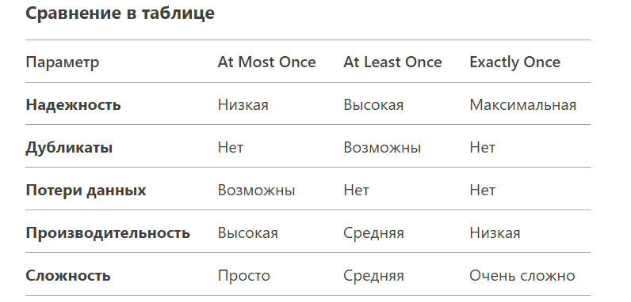
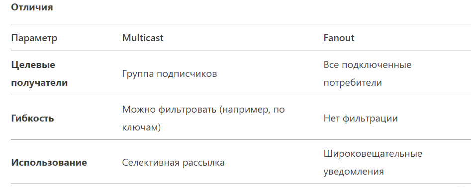

### Брокеры сообщений

#### 1. Push и Pull
Push и Pull — это две основные модели доставки сообщений в системах с брокерами сообщений. Они определяют, как сообщения передаются от отправителя (производителя) к получателю (потребителю). Вот их ключевые различия:
1. Push-модель (проталкивание)
   Как работает:
   Брокер сам отправляет (проталкивает) сообщения потребителям, как только они появляются в очереди или топике.
   Потребитель пассивен — он ждет, пока брокер пришлет сообщение.

Примеры брокеров:
RabbitMQ (использует AMQP с push-подходом), MQTT-брокеры (например, Mosquitto).

Плюсы:
- Низкая задержка: сообщения доставляются мгновенно.
- Простота для потребителя: не нужно постоянно опрашивать брокер.

Минусы:
- Риск перегрузки потребителя: если он не успевает обрабатывать сообщения.
- Сложность балансировки нагрузки между несколькими потребителями.

Используется, когда:
Нужна минимальная задержка, а потребители обладают достаточной производительностью (например, real-time системы).

2. Pull-модель (вытягивание)
   Как работает:
   Потребитель сам запрашивает (вытягивает) сообщения из брокера, когда готов их обработать.
   Брокер пассивен — хранит сообщения, пока потребитель не запросит их.

Примеры брокеров:
Apache Kafka (потребители сами запрашивают данные), Amazon SQS.

Плюсы:
- Контроль над нагрузкой: потребитель сам решает, когда брать сообщения.
- Легче масштабировать: несколько потребителей работают независимо.
- Устойчивость к пикам нагрузки: сообщения накапливаются в брокере.

Минусы:
- Возможные задержки: если потребитель редко опрашивает брокер.
- Выше нагрузка на сеть из-за постоянных запросов.

Используется, когда:
Важна надежность и контроль над обработкой (например, пакетная обработка данных, системы с высокой нагрузкой).

Гибридные подходы
Некоторые брокеры (например, NATS) поддерживают обе модели, позволяя выбирать оптимальный подход под задачу.

Какую модель выбрать?
Push — для real-time систем (чаты, уведомления), где важна мгновенная доставка.

Pull — для распределенных систем с высокой нагрузкой (аналитика, логирование), где надежность и масштабируемость критичны.

#### 2. Режимы доставки at least once, at most once, exactly once?
Режимы доставки сообщений (at least once, at most once, exactly once) определяют, как брокер и потребители гарантируют обработку сообщений. Они критичны для обеспечения надежности и согласованности в распределенных системах. 
Разберем каждый из них:

#### 1. At Most Once (максимум один раз)
   Как работает:
   Сообщение доставляется не более одного раза. Если возникает ошибка (например, сетевой сбой), сообщение может быть потеряно без повторной отправки.

Плюсы:
- Минимальные накладные расходы (нет подтверждений или повторов).
- Высокая пропускная способность.

Минусы:
- Риск потери данных.
- Не подходит для критически важных операций.

Примеры использования:
- Сбор метрик или логов, где потеря части данных допустима.
- Системы реального времени с низкими требованиями к надежности.

Как реализуется:
Продюсер отправляет сообщение без ожидания подтверждения от брокера или потребителя.

#### 2. At Least Once (минимум один раз)
Как работает:
Сообщение гарантированно доставляется, но возможны дубликаты (например, при повторной отправке из-за сбоя).

Плюсы:
- Надежность: данные не теряются.
- Подходит для критически важных операций (платежи, транзакции).

Минусы:
- Риск дублирования сообщений.
- Требует механизма идемпотентности на стороне потребителя.

Примеры использования:
- Финансовые транзакции.
- Обработка заказов в e-commerce.

Как реализуется:
- Брокер сохраняет сообщение до получения подтверждения (ACK) от потребителя.
- Если подтверждение не пришло, сообщение переотправляется (например, RabbitMQ с acknowledgments, Kafka с acks=all).

#### 3. Exactly Once (ровно один раз)
Как работает:
Сообщение доставляется и обрабатывается ровно один раз, без потерь и дубликатов.

Плюсы:
- Идеальная согласованность данных.
- Нет потерь или дублирования.

Минусы:
- Высокие накладные расходы (координация между брокером, продюсером и потребителем).
- Сложность реализации в распределенных системах.

Примеры использования:
- Банковские переводы.
- Системы, где дублирование недопустимо (например, биллинг).

Как реализуется:
- Идемпотентность: Обеспечение, что повторная обработка сообщения не меняет результат (например, Kafka с идемпотентными продюсерами).
- Транзакции: Атомарная фиксация на стороне брокера и потребителя (Kafka Transactions, RabbitMQ с плагинами).
- Дедупликация: Сохранение идентификаторов сообщений и проверка их перед обработкой.




Как выбрать режим?
- At Most Once:
Используйте для данных, где скорость важнее надежности (логирование, метрики).
- At Least Once:
Подходит для большинства сценариев, где надежность критична (транзакции, уведомления).
- Exactly Once:
Только для систем с жесткими требованиями к согласованности (финансовые операции), где дублирование недопустимо.

Примеры брокеров:
- Kafka: Поддерживает exactly once через транзакции и идемпотентных продюсеров.
- RabbitMQ: At least once с подтверждениями (ack), exactly once требует кастомной реализации.
- Amazon SQS: At least once с дедупликацией через MessageDeduplicationId.

Связь с Push/Pull
- Push-модель чаще используется с at least once, чтобы избежать потерь при мгновенной доставке.
- Pull-модель (например, Kafka) удобна для exactly once, так как потребитель контролирует чтение и может использовать оффсеты для дедупликации.

#### 3. Расскажите о идемпотентности?
Идемпотентность — это свойство операции, которое гарантирует, что повторное её выполнение (один или несколько раз) приведет к тому же результату, что и первое успешное выполнение. Это ключевая концепция в распределенных системах, API, базах данных и брокерах сообщений, где возможны сбои, повторы и необходимо обеспечить надежность без дублирования или потери данных.

Зачем нужна идемпотентность?
- Защита от повторов:
В сетевых взаимодействиях (HTTP, RPC, сообщения) возможны повторные запросы из-за таймаутов, ретраев или сбоев. Идемпотентность гарантирует, что повторный вызов не нарушит логику системы.
- Надежность в распределенных системах:
При обработке сообщений (например, в Kafka или RabbitMQ) потребитель может получить одно сообщение несколько раз (at least once delivery). Идемпотентность предотвращает дублирующиеся изменения.
- Упрощение восстановления после сбоев:
Если операция идемпотентна, её можно безопасно повторить после ошибки (например, при разрыве соединения).

Примеры идемпотентности
- 1. HTTP-методы
   Идемпотентные: GET, PUT, DELETE, HEAD.
   Например, вызов PUT /users/123 (обновление данных пользователя) многократно даст тот же результат, что и однократный вызов.
Неидемпотентные: POST (создание ресурса). Повторный вызов POST /users создаст новых пользователей.

- 2. Операции с базой данных
Идемпотентная операция:
```sql
    UPDATE users SET balance = 100 WHERE id = 1; -- Повторы не изменят результат.
```
Неидемпотентная операция:
```sql
    UPDATE users SET balance = balance + 10 WHERE id = 1; -- Каждый повтор увеличит баланс.
```

- 3. Брокеры сообщений
   Если потребитель обрабатывает сообщение с оплатой заказа идемпотентно, повторное получение того же сообщения не спишет деньги дважды.

Как реализовать идемпотентность?
- 1. Уникальные идентификаторы (IDempotency-Key)
   Клиент генерирует уникальный ID для каждой операции (например, UUID).
Сервер сохраняет ID обработанных операций и игнорирует повторы.
Пример: PayPal API использует заголовок Idempotency-Key.

- 2. Версионность (оптимистичные блокировки)
   Для обновления данных передавайте версию объекта.
   Пример:
```sql
   UPDATE orders SET status = 'paid', version = version + 1
   WHERE id = 123 AND version = 5; -- Повторный вызов не сработает.
```
- 3. Дедупликация на стороне брокера
   Kafka: Продюсеры могут быть идемпотентными (настройка enable.idempotence=true), что предотвращает дублирование сообщений при ретраях.
   RabbitMQ: Используйте плагины или сохраняйте ID сообщений для проверки повторов.

- 4. Идемпотентные проектирование операций
   Сделайте операцию перезаписывающей, а не добавляющей.


#### Идемпотентность vs. Атомарность
- Идемпотентность: Один или N вызовов → одинаковый результат.

- Атомарность: Операция выполняется целиком или не выполняется вообще (например, транзакции в БД).

Где критически важна идемпотентность?
- Платежные системы:
Повторная обработка платежа не должна списывать деньги дважды.
- Распределенные транзакции:
Микросервисы должны корректно обрабатывать повторные запросы.
- Синхронизация данных:
Репликация или обновления между системами не должны создавать конфликты.

Идемпотентность — это не просто «теоретическая» концепция, а необходимое свойство для надежных систем.
Без идемпотентности системы становятся уязвимыми к дублированию данных, что особенно критично в финансовых или распределенных средах.

#### 4. Расскажи о Multicast / fanout, job distribution?
1. Multicast и Fanout
   Что это?
   Multicast (многоадресная рассылка):
   Отправка сообщения группе получателей, которые явно подписаны на определенный канал или топик.
   Пример: Рассылка обновлений погоды всем подписчикам в регионе.

   Fanout (широковещательная рассылка):
   Отправка сообщения всем подключенным потребителям без фильтрации.
   Пример: Уведомление всех микросервисов о изменении конфигурации.

Как работают?
В брокерах сообщений:
- Fanout Exchange (RabbitMQ): Сообщения отправляются во все привязанные очереди.
- Топики (Kafka): Сообщения публикуются в топик, а потребители из разных групп получают копии данных.
- Pub/Sub (NATS, Redis): Подписчики получают сообщения, если они подписаны на соответствующий канал.

Пример реализации:
```go
// RabbitMQ Fanout (пример на Golang)
ch.ExchangeDeclare("logs", "fanout", true, false, false, false, nil)
ch.Publish("logs", "", false, false, amqp.Publishing{Body: []byte("Hello!")})
```



2. Распределение задач (Job Distribution)
   Что это?
   Механизм распределения задач (jobs) между несколькими воркерами (потребителями) для параллельной обработки.
   Примеры: Обработка изображений, выполнение фоновых задач, расчет аналитики.

Стратегии распределения
- Round Robin:
Задачи поочередно отправляются всем доступным воркерам.
Подходит для однородных задач и одинаковой производительности воркеров.
- На основе загрузки (Load-Based):
Брокер отправляет задачи наименее загруженным воркерам.
Требует мониторинга состояния воркеров (например, через heartbeat).

- Приоритетные очереди:
Задачи с высоким приоритетом обрабатываются первыми.
Пример: RabbitMQ с плагином x-max-priority.

- Шардирование (Partitioning):
Задачи распределяются по партициям (например, по ключу), и каждая партиция обрабатывается своим воркером.
Пример: Kafka с партиционированными топиками.

Пример на Golang (RabbitMQ Work Queues)
```go
// Продюсер отправляет задачи в очередь
ch.Publish("", "task_queue", false, false, amqp.Publishing{
Body: []byte("task_data"),
})

// Воркеры (потребители) конкурируют за задачи
msgs, _ := ch.Consume("task_queue", "", false, false, false, false, nil)
for msg := range msgs {
processTask(msg.Body)
msg.Ack(false)
}
```

#### Особенности
- Балансировка нагрузки: Равномерное распределение задач предотвращает перегрузку отдельных воркеров.

- Идемпотентность: Повторная доставка задачи (at least once) не должна нарушать логику.

- Масштабируемость: Добавление новых воркеров увеличивает пропускную способность системы.

#### Связь Multicast/Fanout и Job Distribution
- Сценарий Fanout + Job Distribution:

Задача рассылается всем воркерам (fanout), но обрабатывается только одним (через конкурентное потребление).
Пример: Оповещение всех нод кластера о необходимости выполнить задачу, но выполняется она только на одной ноде.

- Multicast для разделения задач:
Задачи разной тематики отправляются в разные топики (multicast), а воркеры подписываются только на нужные.

Пример:

Топик image_processing → воркеры для обработки изображений.

Топик data_analytics → воркеры для аналитики.

#### Примеры брокеров
Fanout: RabbitMQ (Exchange типа fanout), Redis Pub/Sub.

Multicast: Kafka (топики с множеством потребительских групп), MQTT (топики с wildcards).

Job Distribution: Celery (для Python), RabbitMQ Work Queues, Kafka с партициями.

#### Проблемы и решения
- Дублирование задач: Используйте идемпотентность и дедупликацию (например, уникальные ID задач).
- Неравномерная нагрузка: Настройка стратегии балансировки (например, weighted round robin).
- Обработка ошибок: Retry-очереди с экспоненциальной задержкой (dead-letter exchanges в RabbitMQ).

#### Итог
- Multicast/Fanout обеспечивают гибкую доставку сообщений группам потребителей.

- Job Distribution позволяет эффективно распараллеливать задачи, используя стратегии балансировки.

- Комбинация подходов (например, fanout для оповещения + шардирование для распределения) помогает строить масштабируемые и отказоустойчивые системы.

Эти механизмы критичны для современных распределенных приложений, особенно в микросервисной архитектуре, где важно управлять нагрузкой и синхронизировать состояния между сервисами.

