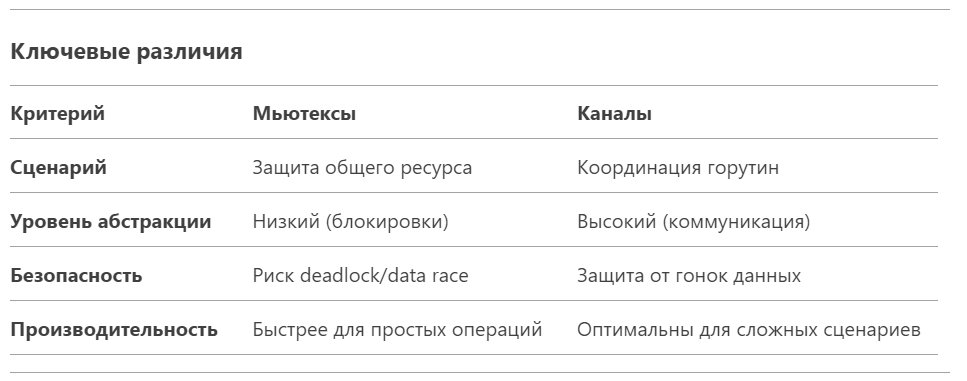
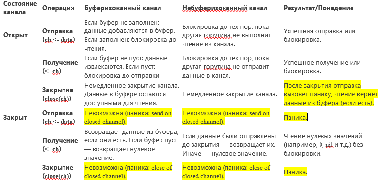

### Синхронизация

#### 1. Mutex vs channel?
Мьютексы (sync.Mutex)
Когда использовать:
- Когда нужно защитить общий ресурс (например, переменную, структуру) от одновременного доступа.
- Для простых сценариев, где требуется эксклюзивный доступ к данным.

Пример:
```go
var counter int
var mu sync.Mutex

func increment() {
    mu.Lock()
    defer mu.Unlock()
    counter++
}
```

Каналы (Channels)
Когда использовать:
- Для комплексной координации горутин (например, передача данных, синхронизация этапов).
- Когда нужно реализовать паттерны типа worker pools, pipelines, fan-in/fan-out.
- Для соблюдения принципа Go: "Do not communicate by sharing memory; instead, share memory by communicating".

Пример:
```go
func worker(jobs <-chan int, results chan<- int) {
    for job := range jobs {
        results <- job * 2
    }
}
```



Что выбрать?
- Мьютексы — для простых случаев, где нужно защитить переменную или структуру.
Пример: счетчик, кэш, состояние приложения.

- Каналы — для сложной логики взаимодействия горутин, потоковой обработки данных или реализации паттернов.
Пример: параллельная обработка задач, распределенные системы, конвейеры.

#### 2. Deadlocks: что представляют собой, как их детектировать, как понять, что это случилось? Как искать причину, дебажить?
Deadlocks (взаимные блокировки) — это ситуации в многопоточном программировании, когда два или более потоков (или горутин в Go) находятся в состоянии ожидания ресурса, который занят другим потоком, и ни один из них не может продолжить выполнение. Это приводит к полной остановке выполнения программы.

Как их детектировать?
В Go deadlocks могут быть обнаружены с помощью встроенных механизмов:

Go runtime: Если Go runtime обнаруживает deadlock, программа завершится с паникой и выведет сообщение, например: 
```
fatal error: all goroutines are asleep - deadlock!
```

Как искать причину и дебажить?
- Анализ трассировки стека: Изучите трассировку стека, чтобы понять, какие горутины и какие ресурсы участвуют в deadlock.

- Проверка логики блокировок: Убедитесь, что потоки не удерживают блокировки слишком долго и что они освобождают ресурсы в правильном порядке.

- Использование таймаутов: В некоторых случаях можно использовать таймауты для каналов или мьютексов, чтобы избежать бесконечного ожидания.

- Рефакторинг кода: Попробуйте изменить порядок блокировок или использовать другие механизмы синхронизации, чтобы избежать deadlock.

- Тестирование: Напишите тесты, которые проверяют возможные deadlock-ситуации, и используйте инструменты статического анализа кода.

Пример deadlock в Go:
```go
package main

import (
	"fmt"
	"sync"
)

func main() {
	var mutex1, mutex2 sync.Mutex

	var wg sync.WaitGroup
	wg.Add(2)

	go func() {
		defer wg.Done()
		mutex1.Lock()
		defer mutex1.Unlock()

		fmt.Println("Goroutine 1 locked mutex1")
		mutex2.Lock()
		defer mutex2.Unlock()

		fmt.Println("Goroutine 1 locked mutex2")
	}()

	go func() {
		defer wg.Done()
		mutex2.Lock()
		defer mutex2.Unlock()

		fmt.Println("Goroutine 2 locked mutex2")
		mutex1.Lock()
		defer mutex1.Unlock()

		fmt.Println("Goroutine 2 locked mutex1")
	}()

	wg.Wait()
}
```
В этом примере две горутины пытаются захватить два мьютекса в разном порядке, что приводит к deadlock.

#### 2. Могут ли быть deadlock при использовании каналов?
Пример deadlock с двумя каналами:
```go
package main

func main() {
	ch1 := make(chan int)
	ch2 := make(chan int)

	go func() {
		<-ch1
		ch2 <- 42
	}()

	go func() {
		<-ch2
		ch1 <- 24
	}()

	// Обе горутины ожидают данных друг от друга, что приводит к deadlock
}
```

Как избежать deadlock с каналами

- Избегайте циклических зависимостей: Убедитесь, что горутины не ожидают данных друг от друга без возможности разорвать цикл.
- Используйте буферизованные каналы: В некоторых случаях буферизованные каналы могут помочь избежать deadlock, так как они позволяют отправлять данные без немедленного получения.
- Используйте таймауты: Можно использовать select с таймаутом для ожидания данных из канала, чтобы избежать бесконечного ожидания.
- Правильное завершение горутин: Убедитесь, что горутины корректно завершают выполнение, закрывая каналы или отправляя сигналы завершения.

Deadlocks с каналами могут быть сложными для диагностики, поэтому важно тщательно продумывать логику взаимодействия горутин и использовать инструменты для анализа и тестирования кода.

#### 3. Как отследить утечку горутин? Пример — как такое может случиться? Как посмотреть количество горутин?
Утечка горутин в Go происходит, когда горутины создаются, но не завершают свое выполнение, что приводит к накоплению ресурсов и может вызвать проблемы с производительностью или даже привести к исчерпанию памяти.

Как отследить утечку горутин
- Мониторинг количества горутин:

* Используйте пакет runtime, чтобы получить количество активных горутин. Это можно сделать с помощью функции runtime.NumGoroutine().

* Профилирование:
Используйте инструменты профилирования, такие как pprof, чтобы анализировать использование ресурсов и выявлять утечки.
Логирование:

* Добавьте логирование в горутины, чтобы отслеживать их создание и завершение. Это поможет выявить, какие горутины не завершают выполнение.

* *Таймауты и контексты:
Используйте контексты с таймаутами для управления временем жизни горутин. Это поможет избежать утечек, если горутина не завершает выполнение в разумное время.
```go
func worker(ctx context.Context) {
    for {
        select {
        case <-ctx.Done():
            return // Выход при отмене
        default:
            // Работа...
        }
    }
}
```

* Проверка на deadlock
  Используйте статический анализатор (например, go vet) для поиска очевидных deadlock:
```
go vet -vet=all ./...
```

Пример утечки горутин:
```go
package main

import (
	"fmt"
	"time"
)

func main() {
	for i := 0; i < 10; i++ {
		go func(i int) {
			fmt.Printf("Goroutine %d is running\n", i)
			// Горутина не завершает выполнение, так как нет выхода из функции
			select {}
		}(i)
	}

	// Даем время для запуска горутин
	time.Sleep(1 * time.Second)
	fmt.Println("Main function exited")
}
```

Рекомендации
- Используйте sync.WaitGroup: Это поможет вам отслеживать завершение горутин и избегать утечек.
- Закрывайте каналы: Убедитесь, что каналы закрываются после завершения работы с ними.
- Избегайте бесконечных циклов: Убедитесь, что горутины имеют условия выхода из циклов.

#### 4. Может ли сборщик мусора автоматически запускаться? Как это регулируется?
В Go сборщик мусора (Garbage Collector, GC) автоматически управляет памятью, освобождая ресурсы, которые больше не используются программой. Он может запускаться автоматически, и его поведение регулируется несколькими механизмами.

#### Автоматический запуск сборщика мусора
- Автоматическое управление:
Сборщик мусора в Go запускается автоматически на основе алгоритма, который учитывает количество выделенной памяти и другие факторы. Он стремится минимизировать накладные расходы на сборку мусора и поддерживать баланс между использованием памяти и производительностью.
- Настройка поведения:
Хотя сборщик мусора управляется автоматически, вы можете повлиять на его поведение с помощью переменных окружения и настроек времени выполнения.

#### Регулирование сборщика мусора
- Переменные окружения:
GOGC: Эта переменная управляет целевым коэффициентом сборки мусора. По умолчанию она равна 100, что означает, что сборщик мусора будет стремиться освободить память, когда объем выделенной памяти удваивается по сравнению с живой памятью (память, которая все еще используется). Вы можете изменить это значение, чтобы настроить частоту сборки мусора. Например, GOGC=200 уменьшит частоту сборки мусора.
- Функции времени выполнения:
    - runtime.GC(): Вы можете вручную инициировать сборку мусора, вызвав эту функцию. Это может быть полезно в определенных ситуациях, когда вы хотите освободить память вручную.
    - runtime.ReadMemStats(): Эта функция позволяет получить статистику использования памяти, включая информацию о сборке мусора.

- Настройка производительности:
Вы можете настроить поведение сборщика мусора, чтобы оптимизировать производительность вашего приложения. Например, для приложений с низкой латентностью можно уменьшить значение GOGC, чтобы сборщик мусора работал чаще, но с меньшими паузами.

### Приведи таблицу состояний при работе с каналами
